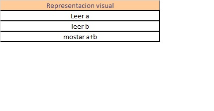

**Algoritmos y Estructuras de Datos**
  
• Curso: K1051 
• Año de cursada: 2018 
• Legajo: 167.574-6 
• Apellido: Troncoso 
• Nombre: Juan  

**Problema**: Obtener del usuario dos números y mostrarle la suma.
Hipotesis: Se debe ingresar 2 numeros reales, se deben sumar y mostrar en pantalla
 
 

**Representacion Textual:**
 
Declaro entero a, entero b
 ingreso a y b
 muestro suma a+b
 
 

**Representacion Visual:**
[]
